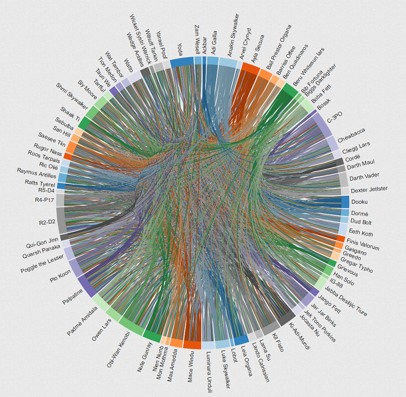

# Star War Data Presentation based on Flux

> A simple app to present data of Star War films that can be easily integrated into html page.

## Running

You must have [npm](https://www.npmjs.org/) installed on your computer.
From the root project directory run these commands from the command line:

    npm install

This will install all dependencies.

To build the project and monitor for updates, first run this command:

    npm start

This will perform an initial build and start a watcher process that will update bundle.js with any changes you wish to make.  This watcher is based on [Browserify](http://browserify.org/) and [Watchify](https://github.com/substack/watchify), and it transforms React's JSX syntax into standard JavaScript with [Reactify](https://github.com/andreypopp/reactify).

To run the app, spin up an HTTP server by:

    npm run server

, and visit http://localhost:3000/index.html.

Or simply open the index.html file in a browser.

## Integrate:

To integrate this component into your app, integrate the three lines below:

    <link rel="stylesheet" href="http://localhost:3000/css/app.css">

    <section id="StarwarPlaceholder"></section>

    

## Character Connections

## Data Source

    http://graphql-swapi.parseapp.com/